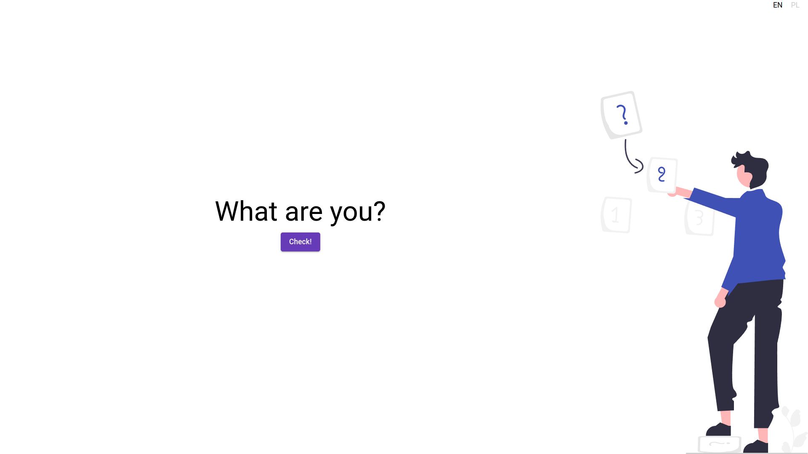
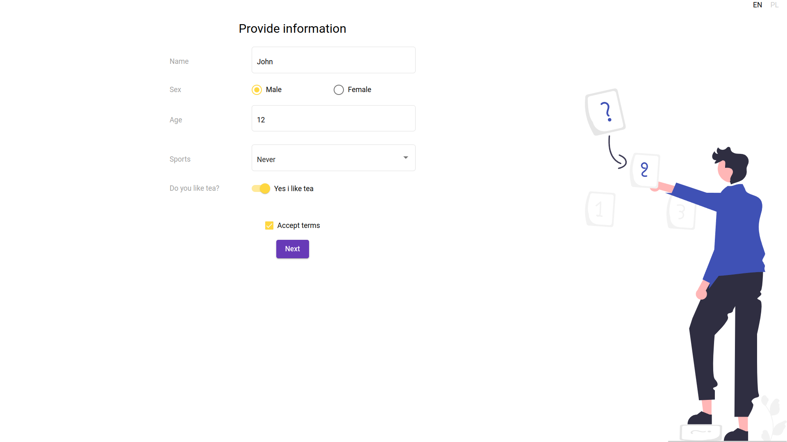
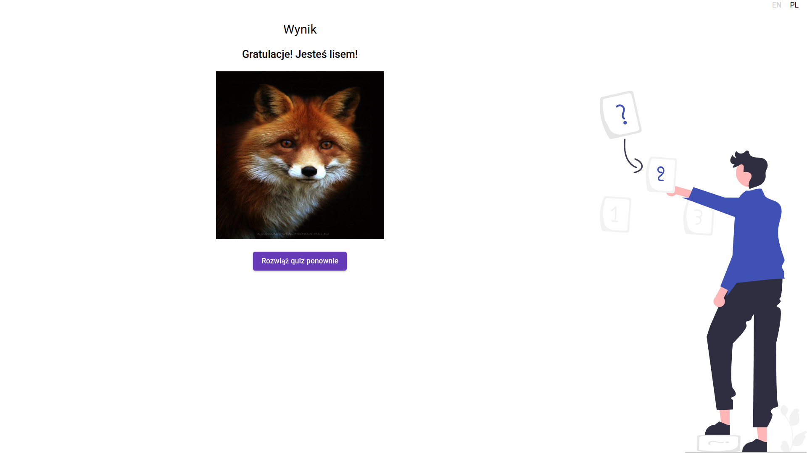

## 0. This is my angular learning project. This is a funny quiz matching animals to you based on a completed form.

## 1. Technologies
* "@angular/core": "^14.2.0",
* "typescript": "~4.7.2"

## 2. What I learned in this project:
* Using rest api(observable)
* Using Angular Forms
* Writing my own Angular Pipes
* Creating Angular Components, Services and Routing
* Creating simple Angular Directives
* Website translations using Angular i18n

## 3. Screens

